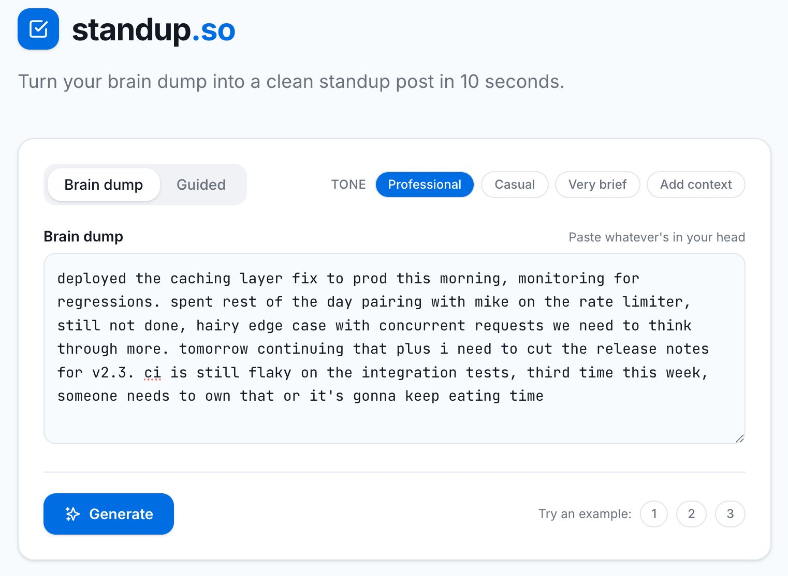
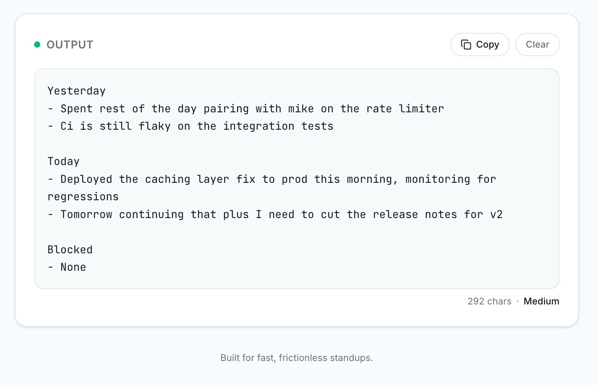
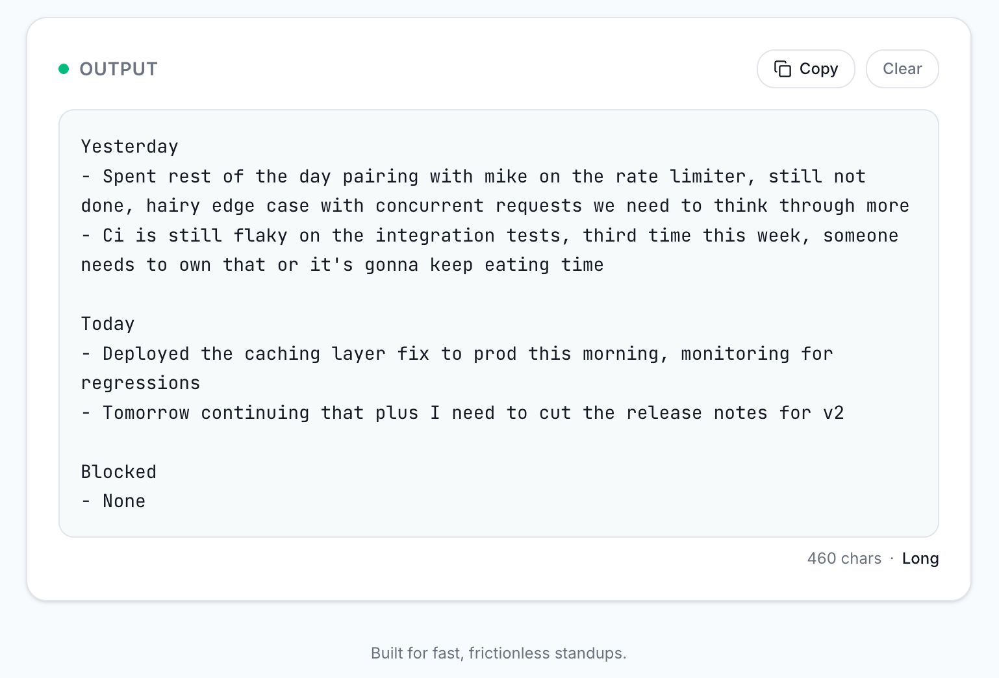
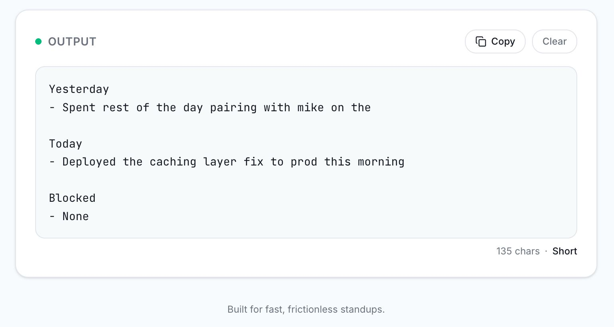
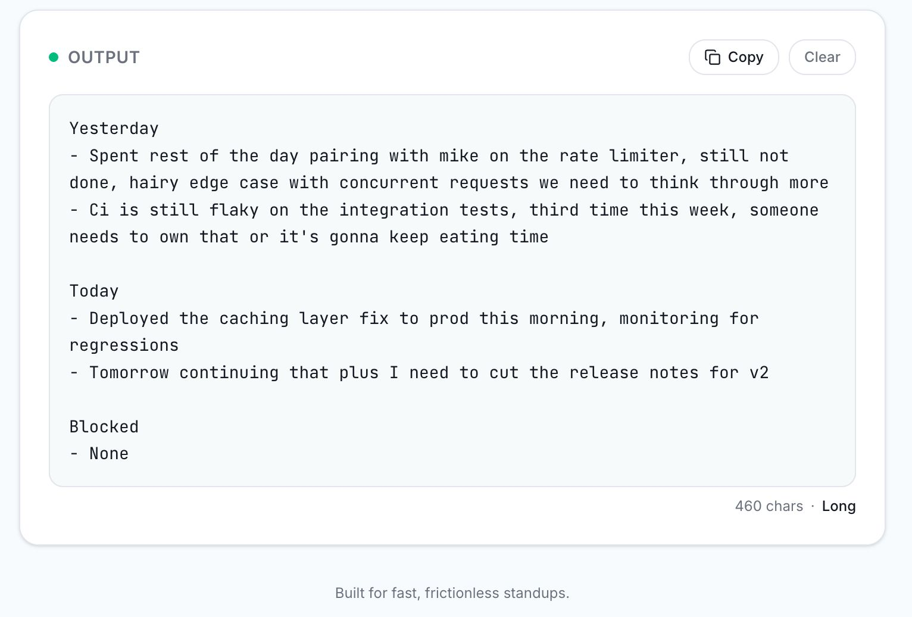

# standup.so

**Turn your brain dump into a clean standup post in 10 seconds.**

Paste your messy thoughts, get a structured Yesterday / Today / Blocked update ready to copy to Slack. No account. No setup. Just paste and go.

Built for the [Mind the Product World Product Day Hackathon 2026](https://www.mindtheproduct.com/).

🔗 **Live:** [standup-so-vyu9.vercel.app](https://standup-so-vyu9.vercel.app)

---

## Screenshots

### Input — brain dump mode
Paste anything: run-on sentences, notes, half-thoughts. No structure required.



### Output — Professional tone
Filler words stripped, active voice, key action surfaced per section.



### Casual tone
Preserves your voice and contractions — reads like you wrote it, just cleaner.



### Very brief tone
One noun phrase per section. Nothing extra.



### Add context tone
Full cleaned sentence — secondary clauses surface the why, outcome, or resolution for stakeholders who aren't in the weeds.



---

## The problem

Every morning, remote workers stare at a blank Slack field. They know what they did — they just can't figure out how to say it without writing a wall of text nobody reads, or three words that tell nobody anything.

## What it does

Two input modes, one AI call, one paste-ready output:

- **Brain dump** — paste whatever's in your head, no structure needed
- **Guided** — answer three quick questions (Yesterday / Today / Blocked)

Four tone options that produce genuinely different output:

| Tone | What it does |
|---|---|
| **Professional** | Strips filler, formal rewrites, truncates to key action |
| **Casual** | Preserves your voice, collapses contractions |
| **Very brief** | One bullet per section, noun-phrase only |
| **Add context** | Full cleaned sentence — secondary clauses surface the why/outcome |

Switching tone auto-regenerates without clicking Generate again. Your preferred tone is saved across sessions.

No accounts. No integrations. Open the URL, get your post.

---

## Stack

| Layer | Choice |
|---|---|
| Framework | Next.js 14 (App Router) |
| Styling | Tailwind CSS |
| AI | Claude claude-sonnet-4-6 via Anthropic API |
| Analytics | Novus.ai (Pendo) |
| Deploy | Vercel |

---

## Local setup

```bash
git clone https://github.com/vaish725/standup-so
cd standup-so
npm install
cp .env.local.example .env.local
```

Edit `.env.local` and add your Anthropic API key:

```env
AI_PROVIDER=anthropic
ANTHROPIC_API_KEY=sk-ant-...
```

Run the dev server:

```bash
npm run dev
```

Open [http://localhost:3000](http://localhost:3000).

> **No API key?** The app falls back to a local stub generator with full tone support — you can develop and test without spending any credits.

---

## Environment variables

| Variable | Required | Description |
|---|---|---|
| `AI_PROVIDER` | Yes | `anthropic` or `openai` |
| `ANTHROPIC_API_KEY` | If using Anthropic | Your Anthropic API key |
| `ANTHROPIC_MODEL` | No | Defaults to `claude-sonnet-4-6` |
| `OPENAI_API_KEY` | If using OpenAI | Your OpenAI API key |
| `OPENAI_MODEL` | No | Defaults to `gpt-4o-mini` |

---

## Deploy to Vercel

[](https://vercel.com/new/clone?repository-url=https://github.com/vaish725/standup-so)

Set `AI_PROVIDER` and `ANTHROPIC_API_KEY` in your Vercel project's Environment Variables, then redeploy.

---

## Analytics

Tracked events via Novus.ai:

| Event | When |
|---|---|
| `page_open` | Every page load |
| `mode_selected` | Brain dump ↔ Guided toggle |
| `generate_clicked` | Generate button |
| `tone_changed` | Any tone pill |
| `output_copied` | Copy button |
| `example_used` | Try an example |
| `return_visit` | User returns on a different day |
